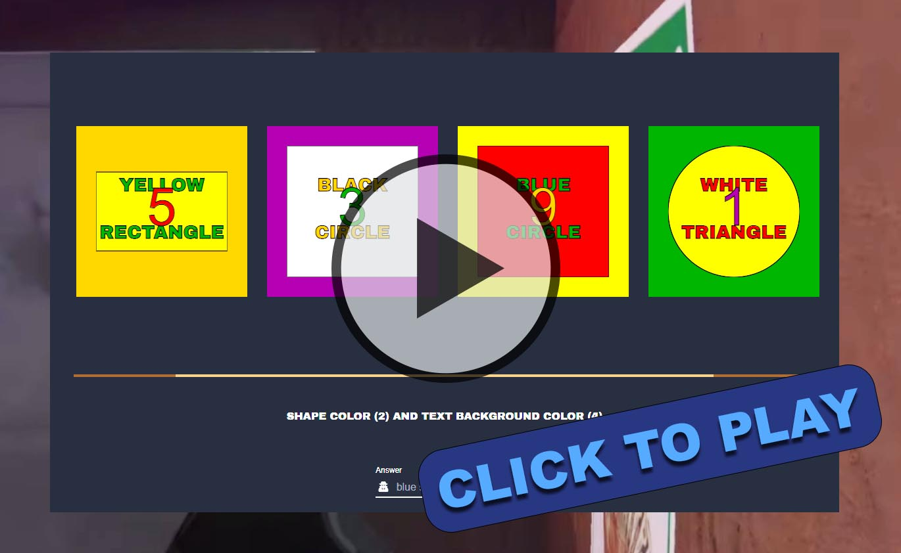

# NoPixel Bank Hack Minigame
An attempt to recreate as closely as possible the bank hack minigame on the whitelisted GTA server NoPixel.  
Feel free to 🌟**star**🌟 the project if you like it.  
Click the thumbnail bellow to try it out!  

## Is something wrong?
If there is some part that is missing or something that isn't working right make an issue here on GitHub it will be looked at.

## New! Language support  

After many requests language support has finally been added.  
The first translations where made by google translate so may not all be perfect.  
If you find that there is a mistake in your language please [read these instructions](./language-instructions/README.md) on how to fix it. 

## Upcoming features
**Randomly alternating text:**  
Thanks to qwewas123 for this pull request.  
Will be implemented with a toggle button for those training on older versions.  

**Better colorblind colors:**  
It seems the NoPixel version updated it's colors. Will add a toggle button for this also.

## Supported browsers
Tested in Chrome, Safari, and Firefox.

## Added features
- Spacebar shortcut to try again
- Customize time to solve puzzle with a slider.
- Customize puzzle squares
- Longer ticking metronome for longer puzzles.
- Hint text to explain what in your answer was wrong.
- Explenation page showing how to solve the puzzles.
- Shortened loading time.
- Try again button

## FiveM version  
You can use this on your FiveM server!  
Check out the README in the fivem-script folder [here](/fivem-script/README.md).

## Before creating a PR
Currently don't want to add many more features, so just creature comforts and cutting down on the code size.
