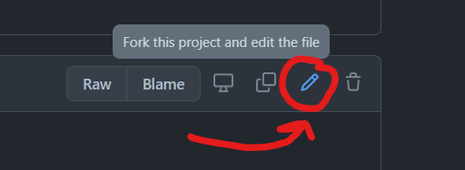
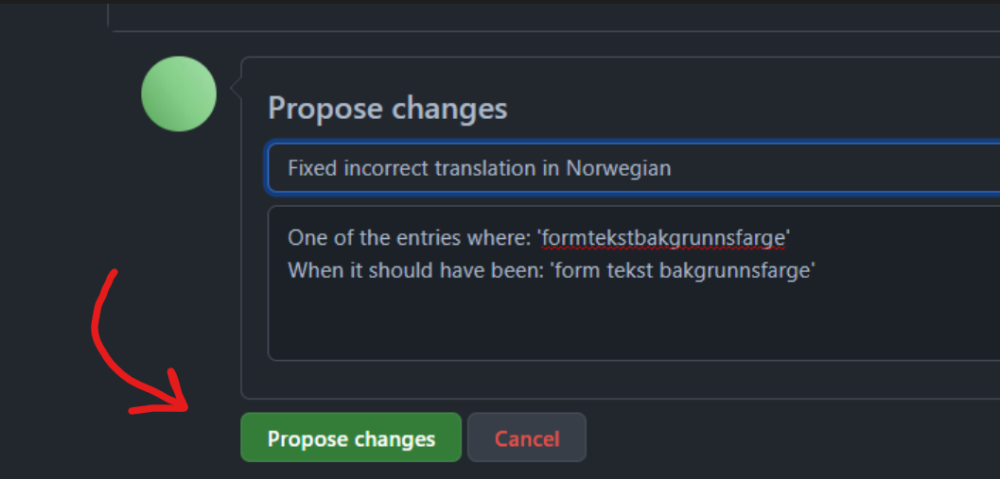
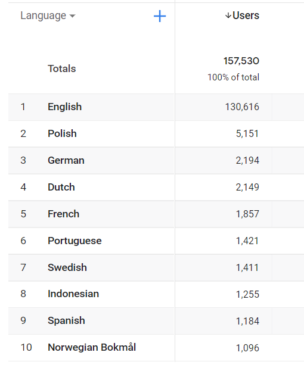

# How to fix or add a language 

Language support was recently added.  
Preliminary implementation was made using Google Translate.  
It is therefore expected that there will be some mistakes and possible improvements to be made.  
That is where you come in!

  
*Currently supported languages*

## How to edit language file

All of the language data is stored in the file `language.js`.  
Any language added or edited there will automatically be update on the site.  

If there is something you want to fix you can edit the file and create a pull request. Your changes can then be reviews and accepted into the official site version.

## Instructions

This will guide you trough making the changes and how to submit these changes to the official site.

1. First you will need a GitHub account if you don't have one already, you can do that [here](https://github.com/join).

2. Go to the language file located at `src/language.js`, or use this [link](https://github.com/Jesper-Hustad/NoPixel-minigame/blob/main/src/language.js).

3. Click the edit button in the top right corner (see image)

4. **Make changes:** This is the fun part. Fix spelling mistakes or add a language. Use the official two letter country code which you can find [here](https://flagicons.lipis.dev/) when adding a language.

5. Propose the changes by adding a message and clicking the green **`Propose changes`** button

6. Click the green **`Create pull request`** button. Your changes will now be officially up for review. Once a maintainer has looked over it they can approve your pull request and the changes will be implemented into the site (and eventually the FiveM mod).

## If you get lost
GitHub can be a bit confusing for new users. If something goes wrong don't panic. You can [watch this video](https://youtu.be/rgbCcBNZcdQ?t=56) on how to create a simple GitHub Pull Request (ignore the command line portion). Do not worry. There is no way you can break the website by making your changes. 

## Language statistics
According to google analytics these are the most popular languages of the current users. This guided the decision in implement the initial languages. This is subject to change. Do not hesitate to create a GitHub issue if you wish your language to be supported. 

